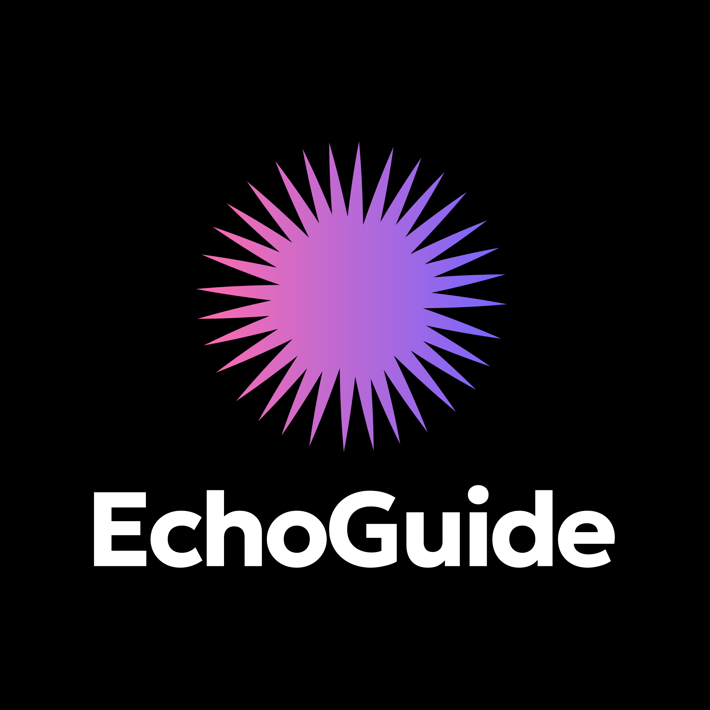

<div align="center">
  
</div>
# EchoGuide: AI-Powered Audio Guide for the Visually Impaired
## **Overview**
This project enables real-time scene understanding and spoken navigation for visually impaired users using computer vision and AI. Currently still under developing.

## 🔧**Pipeline Architecture**

📷 **Camera Feed**  
↓   
🧠 **YOLOv8 Object Detection**  
↓   
📌 **Detected Objects + Bounding Boxes**  
↓  
🧭 **Spatial Analysis (position, distance, urgency)**  
↓  
💬 **LLM Narrator (Llama 3.1 – Groq API)**  
↓  
🗣️ **Navigation Instruction (text)**  
↓  
🔊 **Text-to-Speech (gTTS)**  
↓   
🎧 **Audio Output**  
↓  
🌐 **Flask Web App (User Interface)**


## 🎥**Demo**


## 🛠️**Tech Stack**
**Backend**
- Python
- Flask
- OpenCV
- YOLOv8 (Ultralytics)
- Groq API
- gTTS

**Frontend**
- HTML/CSS/JS
- AJAX for fetching narration + audio
- Live MJPEG video stream

**AI Models**
- YOLOv8n — real-time object detection
- Llama 3.1 / LLM — intelligent navigation guidance
- gTTS — text-to-speech output


## 🔧**Installation**

```bash
1) Clone the repo:
git clone https://github.com/TibyanKhalid/EchoGuide.git
cd EchoGuide

2) Create virtual environment:
python -m venv venv
venv\Scripts\activate

3) Install required libraries and dependencies:
pip install -r requirements.txt

4) Set a Grok token:
setx GROQ_API_KEY "your_token_here"

5) Run the webapp:
python app.py
```

## ⚠️**Limitations**
- Requires stable internet (LLM API)
- Currently supports English Language only
- Works best in well-lit environments
- Navigation accuracy depends on YOLO bounding boxes
